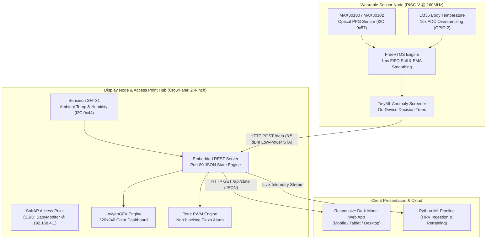
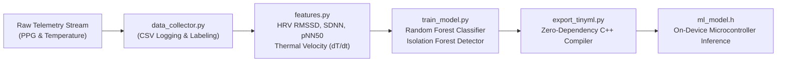

<div align="center">

# KIDSENTINEL

### *Next-Generation Edge-AI Infant Vital Signs & Environmental Monitoring Platform*

[](#system-architecture)
[](#hardware-pinouts)
[](#key-features)
[](#machine-learning--tinyml-pipeline)
[](#hardware-pinouts)
[](LICENSE)

<p align="center">
  <b>A distributed, low-latency biomedical IoT system combining optical PPG pulse oximetry, continuous body thermometry, ambient environmental telemetry, edge anomaly screening, and a standalone responsive web dashboard.</b>
</p>

[TL;DR](#tldr) •
[System Architecture](#system-architecture) •
[Machine Learning Pipeline](#machine-learning--tinyml-pipeline) •
[Hardware Pinouts](#hardware-pinouts) •
[Project Roadmap](#project-roadmap--todo) •
[Clinical Documentation](docs/)

---

</div>

## TL;DR

- **Clinical-Grade Continuous Monitoring**: Solves the latency and false-reassurance problems of passive baby monitors by continuously capturing infant skin temperature (LM35) and optical photoplethysmography (MAX30100/MAX30102 PPG).
- **On-Device Edge ML Anomaly Detection**: Runs an embedded TinyML Random Forest classifier directly on the sensor node to screen for bradycardia (SIDS risk index), tachycardia, fever onset velocity ($dT/dt$), and Heart Rate Variability (HRV) degradation before transmitting alerts.
- **Deterministic FreeRTOS Core**: High-priority 1ms optical FIFO polling task isolates microsecond PPG peak detection from network latency and Wi-Fi stack operations.
- **Dual-Zone Differential Thermometry**: Evaluates infant core-to-environment thermal coupling ($\Delta T = T_{\text{infant}} - T_{\text{ambient}}$) by linking wearable temperature with Sensirion SHT31 nursery room telemetry.
- **Zero-Cloud Dependency**: Runs a standalone SoftAP web server on the display station, serving a real-time dark-mode HTML5 responsive dashboard to any local phone or laptop without external internet or subscriptions.

---

## System Architecture



---

## Key Features

- **Sub-millisecond PPG Sampling**: Dedicated FreeRTOS background task continuously drains the optical FIFO to prevent heartbeat loss during blocking network transactions.
- **Adaptive Signal Filtering**: Outlier rejection ($>25\text{ BPM}$ jumps) paired with Exponential Moving Average (EMA) smoothing for stable cardiac pulse metrics.
- **Edge TinyML Anomaly Screener**: On-device evaluation of infant thermoregulation, tachycardia, bradycardia (SIDS risk), and Heart Rate Variability (HRV) autonomic stability.
- **Dual-Zone Environmental Monitoring**: Simultaneous acquisition of infant skin temperature and nursery ambient temperature/humidity via Sensirion SHT31.
- **Standalone SoftAP & Responsive Dashboard**: Self-contained web server requiring no external router or cloud dependency.
- **Non-blocking Audio-Visual Alarms**: Visual alert banners, beating heart animation, and frequency-modulated piezo buzzer with hardware mute button toggle.

---

## Machine Learning & TinyML Pipeline

Kidsentinel features an integrated Python-based ML training suite to model infant physiological dynamics and compile models into zero-dependency C++ headers for microcontroller execution.



### Feature Engineering & Clinical Indices
- `body_temp`: Infant skin/core temperature (°C) for hyperthermia and neonatal hypothermia detection.
- `heart_rate`: Smoothed optical pulse rate (BPM) for tachycardia and bradycardia screening.
- `hrv_rmssd`: Root Mean Square of Successive RR Differences (ms) measuring parasympathetic autonomic tone.
- `hrv_sdnn`: Standard deviation of RR intervals (ms) assessing overall cardiac autonomic regulation.
- `temp_slope`: Rate of temperature change ($^\circ\text{C}/\text{min}$) detecting rapid fever onset.
- `temp_room_delta`: Infant-to-ambient temperature differential ($\Delta T$) evaluating environmental thermal stress.

---

## Hardware Pinouts

### 1. Sensor Node (ESP32-C6 Dev Module)

| Peripheral | Pin / GPIO | Electrical Protocol | Description |
|---|---|---|---|
| **I2C SDA** | `GPIO 0` | I2C Data (400 kHz) | MAX30100 / MAX30102 PPG data line (4.7k $\Omega$ pull-up) |
| **I2C SCL** | `GPIO 1` | I2C Clock (400 kHz) | MAX30100 / MAX30102 PPG clock line (4.7k $\Omega$ pull-up) |
| **LM35 ADC** | `GPIO 2` | 12-bit Analog In | Analog body temperature sensor ($10\text{ mV}/^\circ\text{C}$) |
| **Power In** | `3V3` & `GND` | Power | 3.3V DC Regulated supply |

### 2. Display Node (CrowPanel 2.4" ILI9341 ESP32)

| Peripheral | Pin / GPIO | Electrical Protocol | Description |
|---|---|---|---|
| **TFT SPI SCLK** | `GPIO 14` | SPI Clock (40 MHz) | ILI9341 display clock |
| **TFT SPI MOSI** | `GPIO 13` | SPI Data In | ILI9341 master out slave in |
| **TFT SPI MISO** | `GPIO 12` | SPI Data Out | ILI9341 master in slave out |
| **TFT SPI D/C** | `GPIO 2` | Digital Control | Data / Command selector line |
| **TFT SPI CS** | `GPIO 15` | Digital Output | Active LOW chip select |
| **TFT Backlight** | `GPIO 27` | Digital Output | Active HIGH backlight enable |
| **Piezo Buzzer** | `GPIO 26` | PWM / Tone | Frequency-modulated audio alarm |
| **Boot Button** | `GPIO 0` | Digital In (`INPUT_PULLUP`) | Hardware alarm mute toggle |
| **SHT31 SDA / SCL** | `GPIO 21` / `GPIO 22` | I2C Fast Mode (400 kHz) | Nursery ambient temperature & humidity |

---

## Project Roadmap & TODO

- [ ] **Ultra-Low-Power BLE Mode**: Implement connectionless BLE advertising mode from sensor node to reduce average current draw to $< 2\text{mA}$.
- [ ] **Dual-Wavelength Pulse Oximetry ($\text{SpO}_2$)**: Complete lookup-table calibration for non-invasive blood oxygen saturation percentage calculation.
- [ ] **Nordic nRF54L15 Wearable Target**: Port sensor acquisition firmware and TinyML inference to Seeed XIAO nRF54L15 (Arm Cortex-M33) for extended coin-cell battery life.
- [ ] **Capacitive Lead-Off Detection**: Add automatic sensor detachment detection to distinguish infant movement from sensor displacement.
- [ ] **Longitudinal Cloud Sync**: Optional local MQTT / Home Assistant telemetry bridging for long-term clinical logging.

---

## Repository Structure

- [`docs/`](docs/) — Detailed clinical rationale and technical manuals:
  - [`architecture.md`](docs/architecture.md) — System topology, bus specifications, and REST API routes
  - [`technical_manual_en.md`](docs/technical_manual_en.md) — Signal processing theory and Beer-Lambert equations
  - [`clinical_findings_en.md`](docs/clinical_findings_en.md) — Clinical background on SIDS, bradycardia, and thermoregulation
- [`firmware/`](firmware/) — Microcontroller source code:
  - [`sensor_node/`](firmware/sensor_node/) — Wearable sensor acquisition, FreeRTOS tasks, and TinyML model
  - [`display_node/`](firmware/display_node/) — Station display manager, LovyanGFX UI, and embedded web server
- [`ml/`](ml/) — Python machine learning suite:
  - [`train_model.py`](ml/train_model.py) — Random Forest & Isolation Forest training
  - [`features.py`](ml/features.py) — HRV & thermal feature extractor
  - [`export_tinyml.py`](ml/export_tinyml.py) — C++ header model compiler
- [`web/`](web/) — Standalone interactive web dashboard preview
- [`tools/`](tools/) — Universal I2C bus diagnostic scanner

---

## Getting Started

### 1. Flash the Display Node
1. Open [`firmware/display_node/display_node.ino`](firmware/display_node/display_node.ino) in Arduino IDE or PlatformIO.
2. Install `LovyanGFX` and `Adafruit SHT31` libraries.
3. Select board `ESP32 Dev Module` and flash to the CrowPanel device.

### 2. Flash the Sensor Node
1. Open [`firmware/sensor_node/sensor_node.ino`](firmware/sensor_node/sensor_node.ino).
2. Install `MAX30100lib`.
3. Select board `ESP32C6 Dev Module` and flash.

### 3. Connect to the Live Dashboard
1. Connect your smartphone or laptop to the Wi-Fi network:
   - **SSID**: `BabyMonitor`
   - **Password**: `12345678`
2. Open your browser and navigate to:
   ```
   http://192.168.4.1/
   ```

---

## License

This project is open-source and released under the [MIT License](LICENSE).
