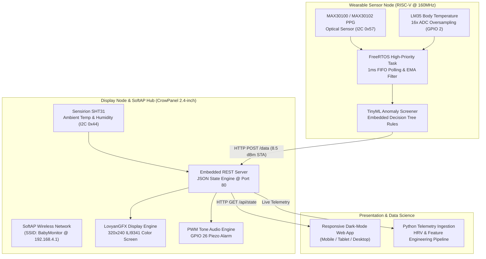

# Kidsentinel System Architecture & Data Protocols

## 1. High-Level Architecture Overview

Kidsentinel is a distributed, low-latency biomedical IoT and edge intelligence system designed to continuously safeguard infant vitals. The ecosystem consists of three decoupled layers:



---

## 2. Wireless Communications & API Specification

### Protocol: HTTP over Dedicated WPA2 SoftAP
- **Access Point SSID**: `BabyMonitor`
- **Default IP Gateway**: `192.168.4.1`
- **Subnet**: `255.255.255.0`
- **RF Power Control**: Transmit power is capped at `8.5 dBm` on the sensor node to minimize peak current spikes and prevent brownouts on low-dropout voltage regulators (LDOs).

### API Endpoints

#### `POST /data`
*Source: Sensor Node -> Destination: Display Node*
- **Content-Type**: `application/x-www-form-urlencoded`
- **Payload**:
  ```http
  temp=36.8&ir=114&ml_alert=0
  ```
- **Response**: `HTTP 200 OK` (plain text)

#### `GET /api/state`
*Source: Web Clients / ML Pipeline -> Destination: Display Node*
- **Response**: `application/json`
  ```json
  {
    "bt": 36.8,
    "hr": 114,
    "rt": 22.5,
    "rh": 48.0,
    "alert": false,
    "msg": "ALL PARAMETERS NORMAL",
    "mute": false,
    "trim": 4.0
  }
  ```

#### `POST /api/settings`
*Source: Web Dashboard -> Destination: Display Node*
- **Content-Type**: `application/x-www-form-urlencoded`
- **Payload**: `trim=3.5&mute=1`
- **Response**: `HTTP 200 OK`

---

## 3. Real-Time Determinism & FreeRTOS Strategy

Optical photoplethysmography requires strict sample timing to prevent FIFO register overflow. Because the `HTTPClient` TCP connection on the ESP32 can block the execution thread for 100–300 milliseconds during packet retransmissions:

1. **POX Worker Task**: A dedicated FreeRTOS task runs at Priority 3 (higher than the main Arduino execution loop at Priority 1) to poll `pox.update()` every 1 millisecond.
2. **Buffer Protection**: Even during Wi-Fi reconnect backoffs, optical pulse peaks and timestamps remain uninterrupted.
