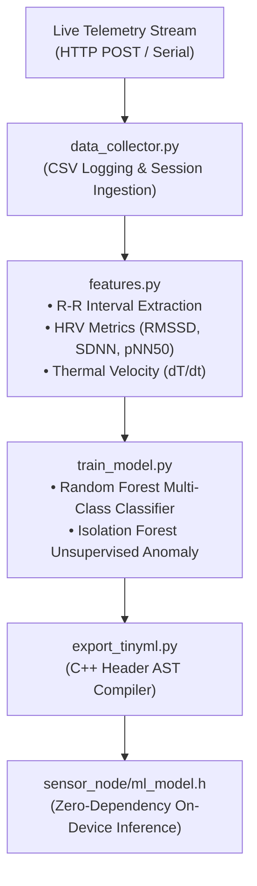

# Kidsentinel Machine Learning & Predictive Analytics Pipeline

This directory provides an end-to-end Machine Learning pipeline tailored for infant vital signs monitoring, Heart Rate Variability (HRV) autonomic tone assessment, early fever/hypothermia trend prediction, and Sudden Infant Death Syndrome (SIDS) risk screening.

---



---

## 1. Feature Engineering & Clinical Indices

The feature extractor ([`features.py`](features.py)) processes raw vital streams across sliding windows:

| Feature Name | Description | Clinical Importance |
| :--- | :--- | :--- |
| `body_temp` | Infant skin/core temperature (°C) | Fever and hypothermia detection |
| `heart_rate` | Smoothed pulse rate (BPM) | Tachycardia / bradycardia screening |
| `hrv_rmssd` | Root Mean Square of Successive RR Diffs (ms) | Autonomic parasympathetic activity & respiratory modulation |
| `hrv_sdnn` | Standard deviation of RR intervals (ms) | Overall cardiac autonomic regulation |
| `hrv_pnn50` | % of interval differences > 50ms | Rapid vagal tone fluctuations |
| `temp_slope` | Rate of temperature change (°C/min) | Predictive fever onset velocity |
| `temp_room_delta` | Infant Temp minus Ambient Temp | Environmental thermal coupling |

---

## 2. Quickstart Guide

### Step 1: Install Dependencies
```bash
pip install -r requirements.txt
```

### Step 2: Generate Synthetic Benchmark Dataset
If physical hardware is not currently connected, generate synthetic benchmark data covering healthy sleep baselines and abnormal events:
```bash
python generate_synthetic_data.py --samples 5000 --output dataset.csv
```

### Step 3: Train Classifier & Anomaly Detector
```bash
python train_model.py --data dataset.csv --out models/
```

### Step 4: Export to TinyML C++ Header
Compile the model into a zero-dependency C++ header for the ESP32-C6 firmware:
```bash
python export_tinyml.py --model models/vital_classifier_rf.joblib --out ../firmware/sensor_node/ml_model.h
```

---

## 3. Real-time Telemetry Ingestion

To log live telemetry from a running Kidsentinel Display Node over Wi-Fi:
```bash
python data_collector.py --http http://192.168.4.1/api/state --output live_telemetry.csv
```

Or via direct Serial port connection:
```bash
python data_collector.py --serial /dev/tty.usbserial-0001 --baud 115200 --output live_serial.csv
```
